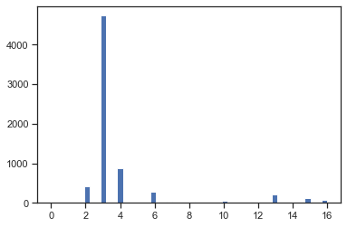
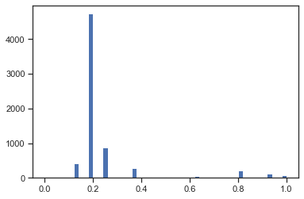
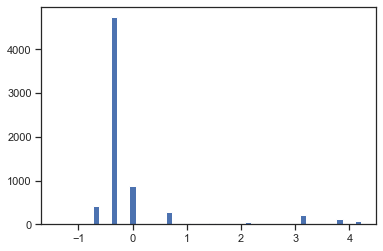
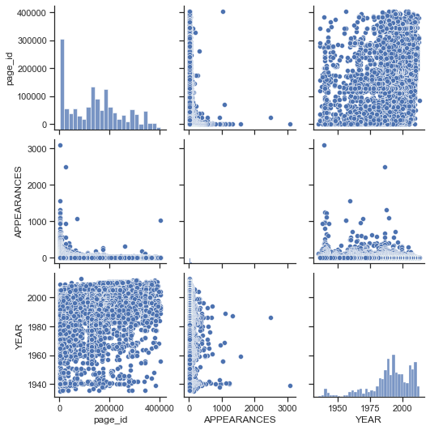

## Хижняков Вадим, ИУ5-65, Вариант 18

### Задача №3.

Для заданного набора данных произведите масштабирование данных (для одного признака) и преобразование категориальных признаков в количественные двумя способами (label encoding, one hot encoding) для одного признака. Какие методы Вы использовали для решения задачи и почему?


```python
import numpy as np
import pandas as pd
import seaborn as sns
import matplotlib.pyplot as plt
%matplotlib inline 
sns.set(style="ticks")
```


```python
data = pd.read_csv('./dc-wikia-data.csv', sep=",")
```


```python
# размер набора данных
data.shape
```


    (6896, 13)


```python
data.info()
```

    <class 'pandas.core.frame.DataFrame'>
    RangeIndex: 6896 entries, 0 to 6895
    Data columns (total 13 columns):
     #   Column            Non-Null Count  Dtype  
    ---  ------            --------------  -----  
     0   page_id           6896 non-null   int64  
     1   name              6896 non-null   object 
     2   urlslug           6896 non-null   object 
     3   ID                4883 non-null   object 
     4   ALIGN             6295 non-null   object 
     5   EYE               3268 non-null   object 
     6   HAIR              4622 non-null   object 
     7   SEX               6771 non-null   object 
     8   GSM               64 non-null     object 
     9   ALIVE             6893 non-null   object 
     10  APPEARANCES       6541 non-null   float64
     11  FIRST APPEARANCE  6827 non-null   object 
     12  YEAR              6827 non-null   float64
    dtypes: float64(2), int64(1), object(10)
    memory usage: 700.5+ KB


```python
# типы колонок
data.dtypes
```


    page_id               int64
    name                 object
    urlslug              object
    ID                   object
    ALIGN                object
    EYE                  object
    HAIR                 object
    SEX                  object
    GSM                  object
    ALIVE                object
    APPEARANCES         float64
    FIRST APPEARANCE     object
    YEAR                float64
    dtype: object


```python
data.head()
```


<div>
<style scoped>
    .dataframe tbody tr th:only-of-type {
        vertical-align: middle;
    }

    .dataframe tbody tr th {
        vertical-align: top;
    }

    .dataframe thead th {
        text-align: right;
    }
</style>
<table border="1" class="dataframe">
  <thead>
    <tr style="text-align: right;">
      <th></th>
      <th>page_id</th>
      <th>name</th>
      <th>urlslug</th>
      <th>ID</th>
      <th>ALIGN</th>
      <th>EYE</th>
      <th>HAIR</th>
      <th>SEX</th>
      <th>GSM</th>
      <th>ALIVE</th>
      <th>APPEARANCES</th>
      <th>FIRST APPEARANCE</th>
      <th>YEAR</th>
    </tr>
  </thead>
  <tbody>
    <tr>
      <th>0</th>
      <td>1422</td>
      <td>Batman (Bruce Wayne)</td>
      <td>\/wiki\/Batman_(Bruce_Wayne)</td>
      <td>Secret Identity</td>
      <td>Good Characters</td>
      <td>Blue Eyes</td>
      <td>Black Hair</td>
      <td>Male Characters</td>
      <td>NaN</td>
      <td>Living Characters</td>
      <td>3093.0</td>
      <td>1939, May</td>
      <td>1939.0</td>
    </tr>
    <tr>
      <th>1</th>
      <td>23387</td>
      <td>Superman (Clark Kent)</td>
      <td>\/wiki\/Superman_(Clark_Kent)</td>
      <td>Secret Identity</td>
      <td>Good Characters</td>
      <td>Blue Eyes</td>
      <td>Black Hair</td>
      <td>Male Characters</td>
      <td>NaN</td>
      <td>Living Characters</td>
      <td>2496.0</td>
      <td>1986, October</td>
      <td>1986.0</td>
    </tr>
    <tr>
      <th>2</th>
      <td>1458</td>
      <td>Green Lantern (Hal Jordan)</td>
      <td>\/wiki\/Green_Lantern_(Hal_Jordan)</td>
      <td>Secret Identity</td>
      <td>Good Characters</td>
      <td>Brown Eyes</td>
      <td>Brown Hair</td>
      <td>Male Characters</td>
      <td>NaN</td>
      <td>Living Characters</td>
      <td>1565.0</td>
      <td>1959, October</td>
      <td>1959.0</td>
    </tr>
    <tr>
      <th>3</th>
      <td>1659</td>
      <td>James Gordon (New Earth)</td>
      <td>\/wiki\/James_Gordon_(New_Earth)</td>
      <td>Public Identity</td>
      <td>Good Characters</td>
      <td>Brown Eyes</td>
      <td>White Hair</td>
      <td>Male Characters</td>
      <td>NaN</td>
      <td>Living Characters</td>
      <td>1316.0</td>
      <td>1987, February</td>
      <td>1987.0</td>
    </tr>
    <tr>
      <th>4</th>
      <td>1576</td>
      <td>Richard Grayson (New Earth)</td>
      <td>\/wiki\/Richard_Grayson_(New_Earth)</td>
      <td>Secret Identity</td>
      <td>Good Characters</td>
      <td>Blue Eyes</td>
      <td>Black Hair</td>
      <td>Male Characters</td>
      <td>NaN</td>
      <td>Living Characters</td>
      <td>1237.0</td>
      <td>1940, April</td>
      <td>1940.0</td>
    </tr>
  </tbody>
</table>
</div>


```python
# проверим есть ли пропущенные значения
data.isnull().sum()
```


    page_id                0
    name                   0
    urlslug                0
    ID                  2013
    ALIGN                601
    EYE                 3628
    HAIR                2274
    SEX                  125
    GSM                 6832
    ALIVE                  3
    APPEARANCES          355
    FIRST APPEARANCE      69
    YEAR                  69
    dtype: int64


```python
total_count = data.shape[0]
print('Всего строк: {}'.format(total_count))
```

    Всего строк: 6896


```python
# Выберем категориальные колонки с пропущенными значениями
# Цикл по колонкам датасета
cat_cols = []
for col in data.columns:
    # Количество пустых значений 
    temp_null_count = data[data[col].isnull()].shape[0]
    dt = str(data[col].dtype)
    if temp_null_count>0 and (dt=='object'):
        cat_cols.append(col)
        temp_perc = round((temp_null_count / total_count) * 100.0, 2)
        print('Колонка {}. Тип данных {}. Количество пустых значений {}, {}%.'.format(col, dt, temp_null_count, temp_perc))
```

    Колонка ID. Тип данных object. Количество пустых значений 2013, 29.19%.
    Колонка ALIGN. Тип данных object. Количество пустых значений 601, 8.72%.
    Колонка EYE. Тип данных object. Количество пустых значений 3628, 52.61%.
    Колонка HAIR. Тип данных object. Количество пустых значений 2274, 32.98%.
    Колонка SEX. Тип данных object. Количество пустых значений 125, 1.81%.
    Колонка GSM. Тип данных object. Количество пустых значений 6832, 99.07%.
    Колонка ALIVE. Тип данных object. Количество пустых значений 3, 0.04%.
    Колонка FIRST APPEARANCE. Тип данных object. Количество пустых значений 69, 1.0%.


```python
from sklearn.impute import SimpleImputer
from sklearn.impute import MissingIndicator
```


```python
eye_cat_data = data[['EYE']]
eye_cat_data.head()
```


<div>
<style scoped>
    .dataframe tbody tr th:only-of-type {
        vertical-align: middle;
    }

    .dataframe tbody tr th {
        vertical-align: top;
    }

    .dataframe thead th {
        text-align: right;
    }
</style>
<table border="1" class="dataframe">
  <thead>
    <tr style="text-align: right;">
      <th></th>
      <th>EYE</th>
    </tr>
  </thead>
  <tbody>
    <tr>
      <th>0</th>
      <td>Blue Eyes</td>
    </tr>
    <tr>
      <th>1</th>
      <td>Blue Eyes</td>
    </tr>
    <tr>
      <th>2</th>
      <td>Brown Eyes</td>
    </tr>
    <tr>
      <th>3</th>
      <td>Brown Eyes</td>
    </tr>
    <tr>
      <th>4</th>
      <td>Blue Eyes</td>
    </tr>
  </tbody>
</table>
</div>


```python
eye_cat_data['EYE'].unique()
```


    array(['Blue Eyes', 'Brown Eyes', 'Green Eyes', 'Purple Eyes',
           'Black Eyes', 'White Eyes', 'Red Eyes', 'Photocellular Eyes',
           'Hazel Eyes', 'Amber Eyes', 'Yellow Eyes', nan, 'Grey Eyes',
           'Pink Eyes', 'Violet Eyes', 'Gold Eyes', 'Orange Eyes',
           'Auburn Hair'], dtype=object)


```python
eye_cat_data[eye_cat_data['EYE'].isnull()].shape
```


    (3628, 1)


```python
# Импьютация наиболее частыми значениями
imp = SimpleImputer(missing_values=np.nan, strategy='most_frequent')
data_imp = imp.fit_transform(eye_cat_data)
data_imp
```


    array([['Blue Eyes'],
           ['Blue Eyes'],
           ['Brown Eyes'],
           ...,
           ['Blue Eyes'],
           ['Blue Eyes'],
           ['Blue Eyes']], dtype=object)


```python
# Пустые значения отсутствуют
np.unique(data_imp)
```


    array(['Amber Eyes', 'Auburn Hair', 'Black Eyes', 'Blue Eyes',
           'Brown Eyes', 'Gold Eyes', 'Green Eyes', 'Grey Eyes', 'Hazel Eyes',
           'Orange Eyes', 'Photocellular Eyes', 'Pink Eyes', 'Purple Eyes',
           'Red Eyes', 'Violet Eyes', 'White Eyes', 'Yellow Eyes'],
          dtype=object)


```python
data_imp.shape
```


    (6896, 1)


### Кодирование категорий наборами бинарных значений - one-hot encoding

В этом случае каждое уникальное значение признака становится новым отдельным признаком.Я буду проводить масштабирование при использовании label encoding, но по заданию надо было сделать и one-hot encoding


```python
eye_cat_enc = pd.DataFrame({'EYE':data_imp.T[0]})
eye_cat_enc
```


<div>
<style scoped>
    .dataframe tbody tr th:only-of-type {
        vertical-align: middle;
    }

    .dataframe tbody tr th {
        vertical-align: top;
    }

    .dataframe thead th {
        text-align: right;
    }
</style>
<table border="1" class="dataframe">
  <thead>
    <tr style="text-align: right;">
      <th></th>
      <th>EYE</th>
    </tr>
  </thead>
  <tbody>
    <tr>
      <th>0</th>
      <td>Blue Eyes</td>
    </tr>
    <tr>
      <th>1</th>
      <td>Blue Eyes</td>
    </tr>
    <tr>
      <th>2</th>
      <td>Brown Eyes</td>
    </tr>
    <tr>
      <th>3</th>
      <td>Brown Eyes</td>
    </tr>
    <tr>
      <th>4</th>
      <td>Blue Eyes</td>
    </tr>
    <tr>
      <th>...</th>
      <td>...</td>
    </tr>
    <tr>
      <th>6891</th>
      <td>Blue Eyes</td>
    </tr>
    <tr>
      <th>6892</th>
      <td>Blue Eyes</td>
    </tr>
    <tr>
      <th>6893</th>
      <td>Blue Eyes</td>
    </tr>
    <tr>
      <th>6894</th>
      <td>Blue Eyes</td>
    </tr>
    <tr>
      <th>6895</th>
      <td>Blue Eyes</td>
    </tr>
  </tbody>
</table>
<p>6896 rows × 1 columns</p>
</div>


```python
from sklearn.preprocessing import OneHotEncoder
```


```python
ohe = OneHotEncoder()
eye_cat_enc_ohe = ohe.fit_transform(eye_cat_enc[['EYE']])
```


```python
eye_cat_enc_ohe.shape
```


    (6896, 17)


```python
eye_cat_enc_ohe.todense()[0:10]
```


    matrix([[0., 0., 0., 1., 0., 0., 0., 0., 0., 0., 0., 0., 0., 0., 0., 0.,
             0.],
            [0., 0., 0., 1., 0., 0., 0., 0., 0., 0., 0., 0., 0., 0., 0., 0.,
             0.],
            [0., 0., 0., 0., 1., 0., 0., 0., 0., 0., 0., 0., 0., 0., 0., 0.,
             0.],
            [0., 0., 0., 0., 1., 0., 0., 0., 0., 0., 0., 0., 0., 0., 0., 0.,
             0.],
            [0., 0., 0., 1., 0., 0., 0., 0., 0., 0., 0., 0., 0., 0., 0., 0.,
             0.],
            [0., 0., 0., 1., 0., 0., 0., 0., 0., 0., 0., 0., 0., 0., 0., 0.,
             0.],
            [0., 0., 0., 1., 0., 0., 0., 0., 0., 0., 0., 0., 0., 0., 0., 0.,
             0.],
            [0., 0., 0., 1., 0., 0., 0., 0., 0., 0., 0., 0., 0., 0., 0., 0.,
             0.],
            [0., 0., 0., 1., 0., 0., 0., 0., 0., 0., 0., 0., 0., 0., 0., 0.,
             0.],
            [0., 0., 0., 1., 0., 0., 0., 0., 0., 0., 0., 0., 0., 0., 0., 0.,
             0.]])


```python
pd.get_dummies(eye_cat_enc).head()
```


<div>
<style scoped>
    .dataframe tbody tr th:only-of-type {
        vertical-align: middle;
    }

    .dataframe tbody tr th {
        vertical-align: top;
    }

    .dataframe thead th {
        text-align: right;
    }
</style>
<table border="1" class="dataframe">
  <thead>
    <tr style="text-align: right;">
      <th></th>
      <th>EYE_Amber Eyes</th>
      <th>EYE_Auburn Hair</th>
      <th>EYE_Black Eyes</th>
      <th>EYE_Blue Eyes</th>
      <th>EYE_Brown Eyes</th>
      <th>EYE_Gold Eyes</th>
      <th>EYE_Green Eyes</th>
      <th>EYE_Grey Eyes</th>
      <th>EYE_Hazel Eyes</th>
      <th>EYE_Orange Eyes</th>
      <th>EYE_Photocellular Eyes</th>
      <th>EYE_Pink Eyes</th>
      <th>EYE_Purple Eyes</th>
      <th>EYE_Red Eyes</th>
      <th>EYE_Violet Eyes</th>
      <th>EYE_White Eyes</th>
      <th>EYE_Yellow Eyes</th>
    </tr>
  </thead>
  <tbody>
    <tr>
      <th>0</th>
      <td>0</td>
      <td>0</td>
      <td>0</td>
      <td>1</td>
      <td>0</td>
      <td>0</td>
      <td>0</td>
      <td>0</td>
      <td>0</td>
      <td>0</td>
      <td>0</td>
      <td>0</td>
      <td>0</td>
      <td>0</td>
      <td>0</td>
      <td>0</td>
      <td>0</td>
    </tr>
    <tr>
      <th>1</th>
      <td>0</td>
      <td>0</td>
      <td>0</td>
      <td>1</td>
      <td>0</td>
      <td>0</td>
      <td>0</td>
      <td>0</td>
      <td>0</td>
      <td>0</td>
      <td>0</td>
      <td>0</td>
      <td>0</td>
      <td>0</td>
      <td>0</td>
      <td>0</td>
      <td>0</td>
    </tr>
    <tr>
      <th>2</th>
      <td>0</td>
      <td>0</td>
      <td>0</td>
      <td>0</td>
      <td>1</td>
      <td>0</td>
      <td>0</td>
      <td>0</td>
      <td>0</td>
      <td>0</td>
      <td>0</td>
      <td>0</td>
      <td>0</td>
      <td>0</td>
      <td>0</td>
      <td>0</td>
      <td>0</td>
    </tr>
    <tr>
      <th>3</th>
      <td>0</td>
      <td>0</td>
      <td>0</td>
      <td>0</td>
      <td>1</td>
      <td>0</td>
      <td>0</td>
      <td>0</td>
      <td>0</td>
      <td>0</td>
      <td>0</td>
      <td>0</td>
      <td>0</td>
      <td>0</td>
      <td>0</td>
      <td>0</td>
      <td>0</td>
    </tr>
    <tr>
      <th>4</th>
      <td>0</td>
      <td>0</td>
      <td>0</td>
      <td>1</td>
      <td>0</td>
      <td>0</td>
      <td>0</td>
      <td>0</td>
      <td>0</td>
      <td>0</td>
      <td>0</td>
      <td>0</td>
      <td>0</td>
      <td>0</td>
      <td>0</td>
      <td>0</td>
      <td>0</td>
    </tr>
  </tbody>
</table>
</div>


```python
pd.get_dummies(eye_cat_data, dummy_na=True).head()
```


<div>
<style scoped>
    .dataframe tbody tr th:only-of-type {
        vertical-align: middle;
    }

    .dataframe tbody tr th {
        vertical-align: top;
    }

    .dataframe thead th {
        text-align: right;
    }
</style>
<table border="1" class="dataframe">
  <thead>
    <tr style="text-align: right;">
      <th></th>
      <th>EYE_Amber Eyes</th>
      <th>EYE_Auburn Hair</th>
      <th>EYE_Black Eyes</th>
      <th>EYE_Blue Eyes</th>
      <th>EYE_Brown Eyes</th>
      <th>EYE_Gold Eyes</th>
      <th>EYE_Green Eyes</th>
      <th>EYE_Grey Eyes</th>
      <th>EYE_Hazel Eyes</th>
      <th>EYE_Orange Eyes</th>
      <th>EYE_Photocellular Eyes</th>
      <th>EYE_Pink Eyes</th>
      <th>EYE_Purple Eyes</th>
      <th>EYE_Red Eyes</th>
      <th>EYE_Violet Eyes</th>
      <th>EYE_White Eyes</th>
      <th>EYE_Yellow Eyes</th>
      <th>EYE_nan</th>
    </tr>
  </thead>
  <tbody>
    <tr>
      <th>0</th>
      <td>0</td>
      <td>0</td>
      <td>0</td>
      <td>1</td>
      <td>0</td>
      <td>0</td>
      <td>0</td>
      <td>0</td>
      <td>0</td>
      <td>0</td>
      <td>0</td>
      <td>0</td>
      <td>0</td>
      <td>0</td>
      <td>0</td>
      <td>0</td>
      <td>0</td>
      <td>0</td>
    </tr>
    <tr>
      <th>1</th>
      <td>0</td>
      <td>0</td>
      <td>0</td>
      <td>1</td>
      <td>0</td>
      <td>0</td>
      <td>0</td>
      <td>0</td>
      <td>0</td>
      <td>0</td>
      <td>0</td>
      <td>0</td>
      <td>0</td>
      <td>0</td>
      <td>0</td>
      <td>0</td>
      <td>0</td>
      <td>0</td>
    </tr>
    <tr>
      <th>2</th>
      <td>0</td>
      <td>0</td>
      <td>0</td>
      <td>0</td>
      <td>1</td>
      <td>0</td>
      <td>0</td>
      <td>0</td>
      <td>0</td>
      <td>0</td>
      <td>0</td>
      <td>0</td>
      <td>0</td>
      <td>0</td>
      <td>0</td>
      <td>0</td>
      <td>0</td>
      <td>0</td>
    </tr>
    <tr>
      <th>3</th>
      <td>0</td>
      <td>0</td>
      <td>0</td>
      <td>0</td>
      <td>1</td>
      <td>0</td>
      <td>0</td>
      <td>0</td>
      <td>0</td>
      <td>0</td>
      <td>0</td>
      <td>0</td>
      <td>0</td>
      <td>0</td>
      <td>0</td>
      <td>0</td>
      <td>0</td>
      <td>0</td>
    </tr>
    <tr>
      <th>4</th>
      <td>0</td>
      <td>0</td>
      <td>0</td>
      <td>1</td>
      <td>0</td>
      <td>0</td>
      <td>0</td>
      <td>0</td>
      <td>0</td>
      <td>0</td>
      <td>0</td>
      <td>0</td>
      <td>0</td>
      <td>0</td>
      <td>0</td>
      <td>0</td>
      <td>0</td>
      <td>0</td>
    </tr>
  </tbody>
</table>
</div>


### Использование LabelEncoder

Был выбран из-за своей ориентации на применение к одному признаку, в нашем случае цвет глаз


```python
from sklearn.preprocessing import LabelEncoder
```


```python
eye_cat_enc['EYE'].unique()
```


    array(['Blue Eyes', 'Brown Eyes', 'Green Eyes', 'Purple Eyes',
           'Black Eyes', 'White Eyes', 'Red Eyes', 'Photocellular Eyes',
           'Hazel Eyes', 'Amber Eyes', 'Yellow Eyes', 'Grey Eyes',
           'Pink Eyes', 'Violet Eyes', 'Gold Eyes', 'Orange Eyes',
           'Auburn Hair'], dtype=object)


```python
le = LabelEncoder()
eye_cat_enc_le = le.fit_transform(eye_cat_enc['EYE'])
```


```python
eye_cat_enc_le
```


    array([3, 3, 4, ..., 3, 3, 3])


```python
np.unique(eye_cat_enc_le)
```


    array([ 0,  1,  2,  3,  4,  5,  6,  7,  8,  9, 10, 11, 12, 13, 14, 15, 16])


```python
le.inverse_transform([n for n in range(17)])
```


    array(['Amber Eyes', 'Auburn Hair', 'Black Eyes', 'Blue Eyes',
           'Brown Eyes', 'Gold Eyes', 'Green Eyes', 'Grey Eyes', 'Hazel Eyes',
           'Orange Eyes', 'Photocellular Eyes', 'Pink Eyes', 'Purple Eyes',
           'Red Eyes', 'Violet Eyes', 'White Eyes', 'Yellow Eyes'],
          dtype=object)


```python
data_digit = eye_cat_enc.copy()
data_digit["EYE"] = eye_cat_enc_le
```

### Масштабирование


```python
from sklearn.preprocessing import MinMaxScaler, StandardScaler, Normalizer
```


```python
sc1 = MinMaxScaler()
sc1_data = sc1.fit_transform(data_digit[['EYE']])
```


```python
plt.hist(data_digit['EYE'], 50)
plt.show()
```


    

    


```python
plt.hist(sc1_data, 50)
plt.show()
```


    

    


### Масштабирование данных на основе Z-оценки - StandardScaler


```python
sc2 = StandardScaler()
sc2_data = sc2.fit_transform(data_digit[['EYE']])
```


```python
plt.hist(sc2_data, 50)
plt.show()
```


    

    


### Парные диаграммы


```python
sns.pairplot(data)
```


    <seaborn.axisgrid.PairGrid at 0x7f863a197e80>


    

    

